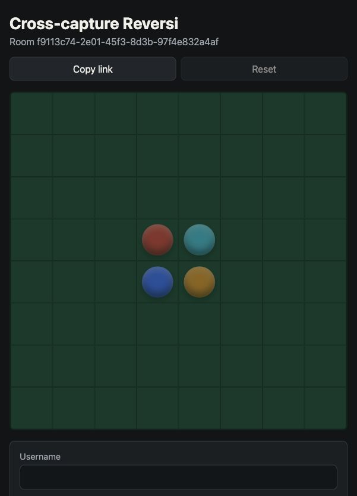

# Cross-capture Reversi

A simple 2v2 Reversi prototype for Cloudflare Workers.



## Teams

- Red + Orange vs Blue + Cyan
- Every room has four seats: Red, Blue, Orange, Cyan
- The game starts once two players join each team

## Rules

Cross-capture Reversi changes the capture endpoint rule:

- Partner discs count as friendly endpoints.
- Partner discs cannot be flipped.
- Enemy discs flip into the mover's color.

Example:

```text
R O B B .
```

Red can capture through enemy discs using Orange as the friendly endpoint. That creates positions normal two-color Reversi cannot express.

## Rooms And Rejoining

- Visiting `/` creates a public UUID room URL.
- Everyone joins the same room URL.
- Players choose a username and a team.
- Room state is stored in the room Durable Object, so the game survives disconnects.
- A disconnected player can reclaim their seat by rejoining with the same username.

## Architecture

This uses the smallest production-shaped Cloudflare setup:

- Static HTML/CSS/JS served by Workers Assets.
- One `GameRoom` Durable Object per room ID.
- WebSockets for live state updates.
- Durable Object storage for the current game state.

PartyKit is a good fit for larger real-time apps, but this prototype uses the underlying Cloudflare primitive directly because the state machine is small and turn-based.

## Development

```bash
npm install
npm run dev
```

Open `http://localhost:8787`.

## Checks

```bash
npm test
npm run typecheck
```

## Deploy

```bash
npm run deploy
```
